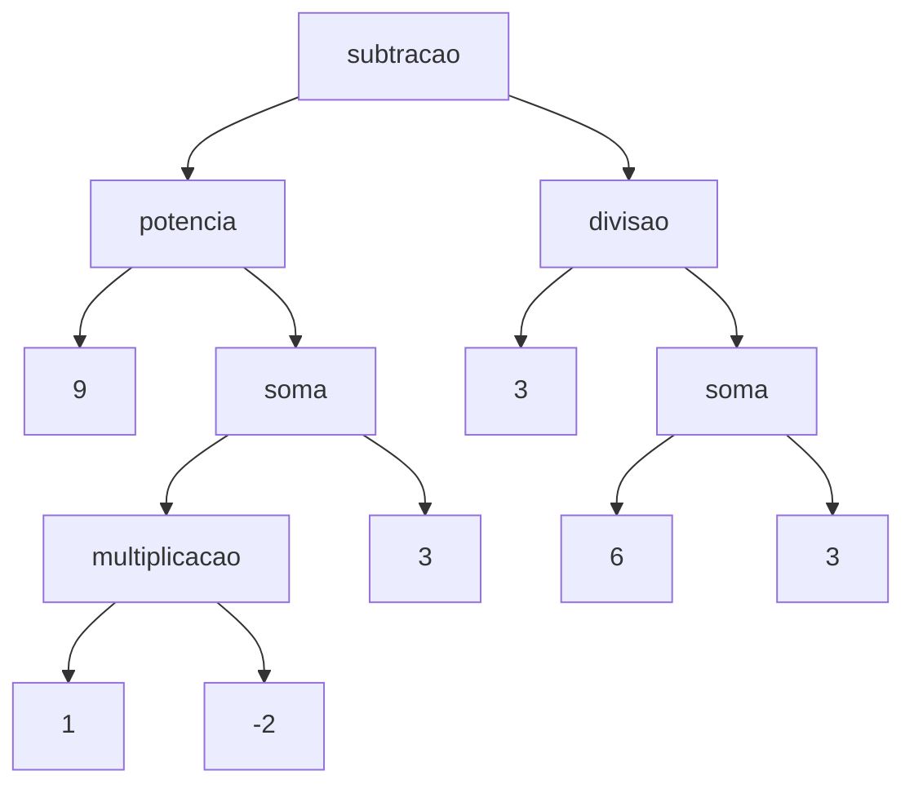

# 🧮 Parser de Expressões Matemáticas + Gramáticas (Earley e CNF)

## 📌 Objetivo

Este trabalho apresenta:

* Um **parser de expressões matemáticas em Ruby**
* A **gramática livre de contexto (CFG)** para uso com o algoritmo de **Earley**
* A mesma gramática convertida para a **Forma Normal de Chomsky (CNF)** para uso com **CYK**
* A **árvore sintática (AST)** da expressão:

```text
9^(1 * -2 + 3) - 3 / ( 6 + 3 )
```

---

## 🧠 Gramática (forma geral - Earley)

```text
E  -> E + T | E - T | T
T  -> T * P | T / P | P
P  -> F ^ P | F
F  -> ( E ) | N | - N
N  -> D N | D
D  -> 0 | 1 | 2 | 3 | 4 | 5 | 6 | 7 | 8 | 9
```

### ✔ Características

* Suporta precedência de operadores
* Suporta números negativos (`-2`)
* Suporta parênteses

---

## 🔷 Gramática em Forma Normal de Chomsky (CNF)

```text
E  -> E X1 | E X2 | T
X1 -> MAIS T
X2 -> MENOS T

T  -> T X3 | T X4 | P
X3 -> MULT P
X4 -> DIV P

P  -> F X5 | F
X5 -> POT P

F  -> EP Y1 | N | NEG N
Y1 -> E DP

N  -> D N | D

MAIS  -> +
MENOS -> -
MULT  -> *
DIV   -> /
POT   -> ^
EP    -> (
DP    -> )
NEG   -> -

D -> 0 | 1 | 2 | 3 | 4 | 5 | 6 | 7 | 8 | 9
```

---

## 🌳 Árvore Sintática da Expressão

Expressão:

```text
9^(1 * -2 + 3) - 3 / ( 6 + 3 )
```

### Representação em AST:

```text
["subtracao",
   ["potencia",
      9,
      ["soma",
         ["multiplicacao", 1, -2],
         3
      ]
   ],
   ["divisao",
      3,
      ["soma", 6, 3]
   ]
]
```

### Representação em árvore:



---


## ▶️ Como Executar

```bash
ruby parser.rb
```

Digite:

```text
9^(1 * -2 + 3) - 3 / ( 6 + 3 )
```

---

